# PVM Debugger Usage Guide

PVM Debugger is a browser-based debugger for Polkavm Virtual Machine programs. You can load bundled examples, upload local files, inspect machine state, compare trace-backed host calls, and switch between multiple PVM implementations from one UI.

## 1. Getting Started

Start the app locally with `npm run dev`, then open `http://localhost:5173`.

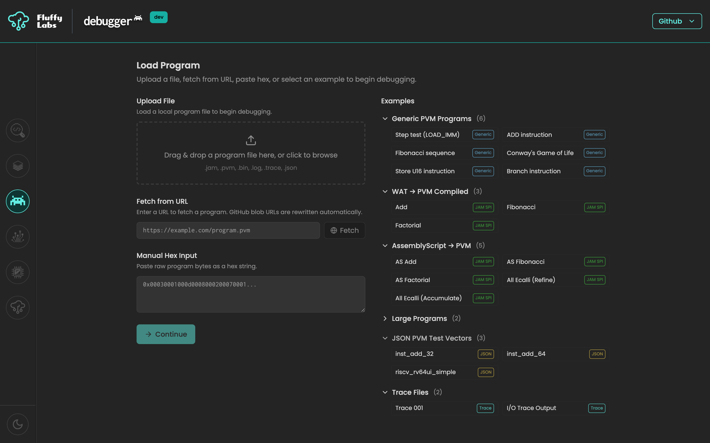

## 2. Loading a Program

### From Examples

Use the examples column on the right to open bundled programs. The six categories are Generic PVM, WAT to PVM, AssemblyScript, Large Programs, JSON Test Vectors, and Trace Files. Click any example to jump straight to the configuration step.

### From File Upload

Drop a file or use the browse button to load `.jam`, `.pvm`, `.bin`, `.log`, `.trace`, or `.json` input from disk.

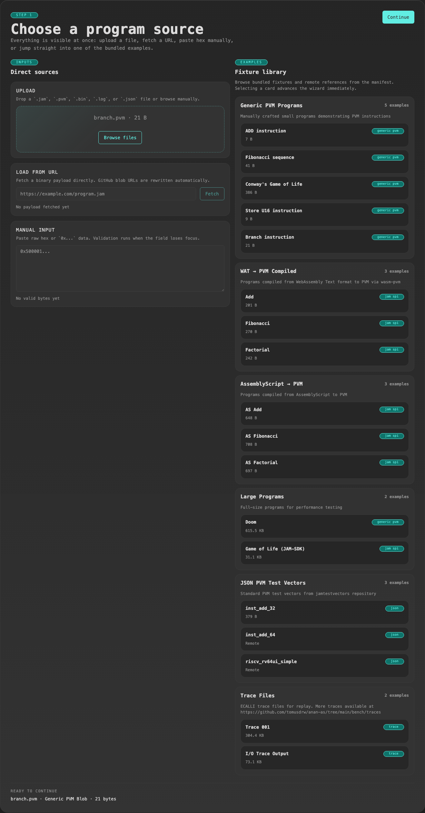

### From URL

Paste a direct file URL to fetch content into the loader. GitHub `blob` URLs are rewritten to raw content automatically before fetch.

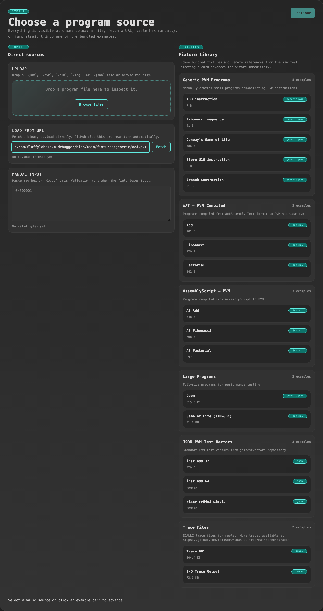

### From Manual Hex Input

Paste raw hex bytes when you want to debug a tiny program without creating a file first. The loader validates the input when the field loses focus.

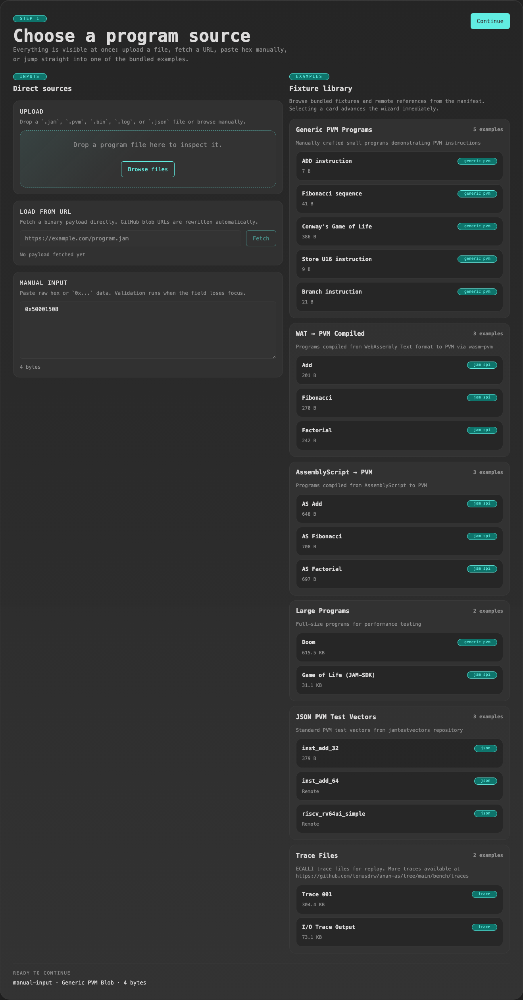

## 3. Configuring the Program

After source selection, review the detected format summary and adjust any format-specific options before loading the debugger. For JAM SPI programs, Builder mode exposes the entrypoint form and RAW mode lets you edit the encoded argument bytes directly.

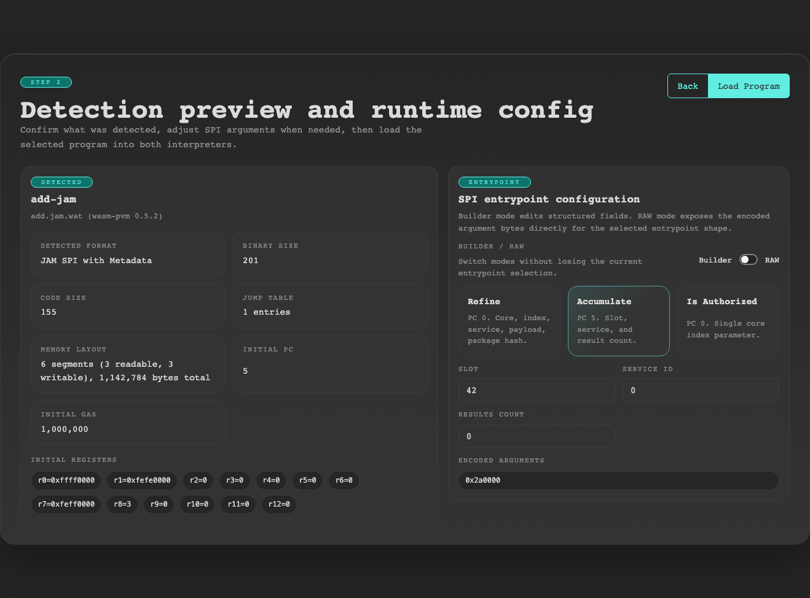

Use `Refine`, `Accumulate`, or `Is Authorized` depending on which SPI entrypoint you want to invoke. Gas is not configured here; you can edit gas later from the debugger.

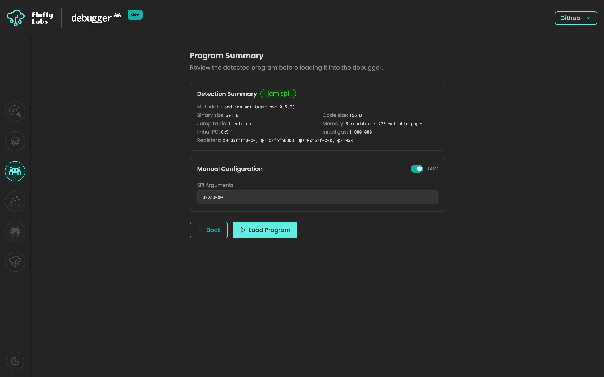

## 4. The Debugger Screen

Once the program loads, the debugger shows three main columns: Instructions on the left, Registers and Status in the center, and Memory on the right. The execution controls stay in the top bar, and the bottom drawer holds Settings, Ecalli Trace, Host Call, and Logs.

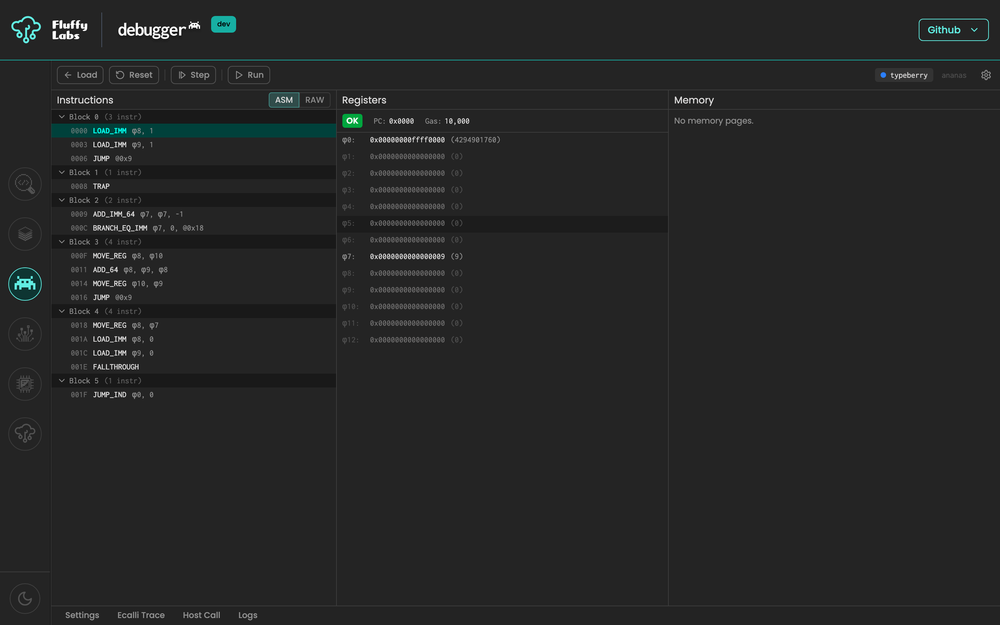

## 5. Stepping Through Code

Use `Next` to advance one instruction, `Step` to use the configured stepping mode, `Run` to continue until a stop condition, `Pause` to stop a run loop, and `Reset` to reload the initial program state. Keyboard shortcuts are:

- `F10` for `Next`
- `F5` for `Run` / `Pause`
- `Ctrl+Shift+R` for `Reset`

Choose the `Instruction`, `Block`, or `N-Instructions` stepping mode from the Settings drawer.

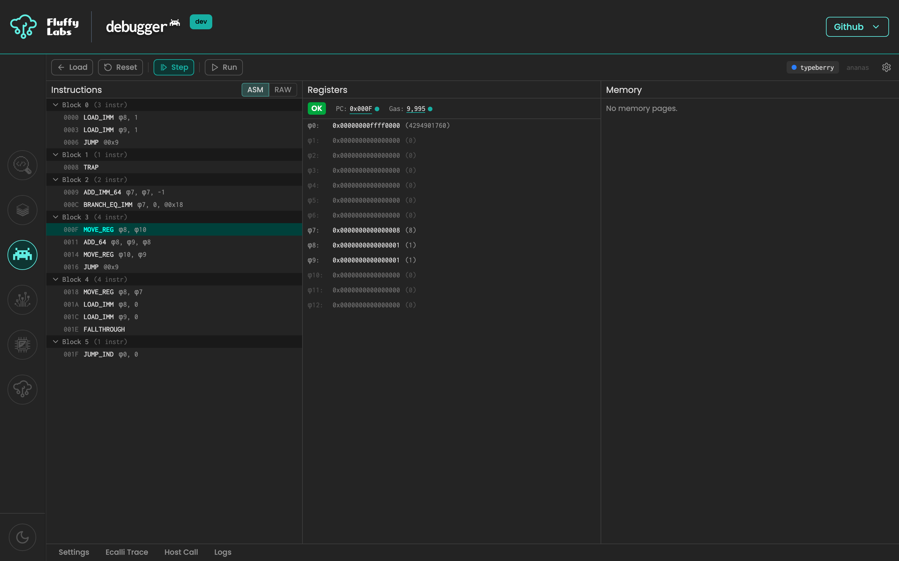

## 6. Working With Registers and State

When execution is paused, you can edit the PC, gas, and all 13 registers inline. Registers always show a fixed-width hex encoding and a decimal value, PC is displayed in hex, and gas is displayed in decimal with a hex tooltip.

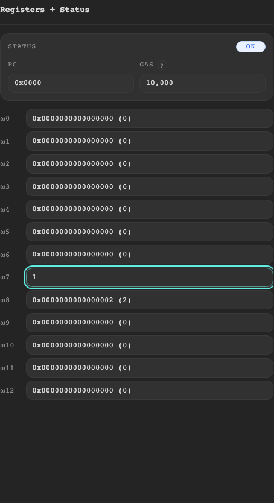

## 7. Viewing Memory

Expand any mapped memory range to inspect bytes in a hex dump. Ranges are lazy-loaded, collapsed by default, and changed bytes are highlighted after execution mutates memory.

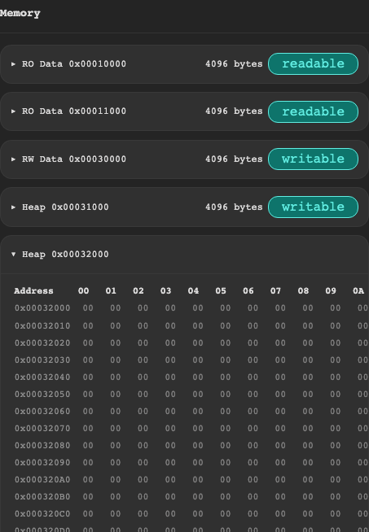

## 8. Host Calls

When execution pauses on an `ecalli`, the Host Call drawer opens automatically. Review the decoded call, then use the normal `Next`, `Step`, or `Run` controls to continue. There is no separate resume button.

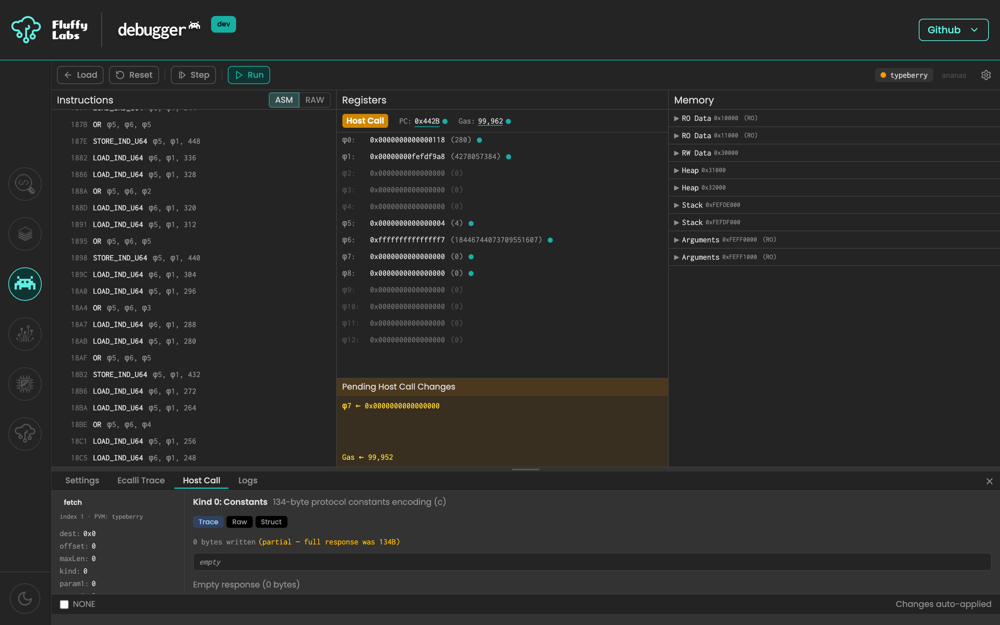

Log host calls render decoded text and raw payload data when available.

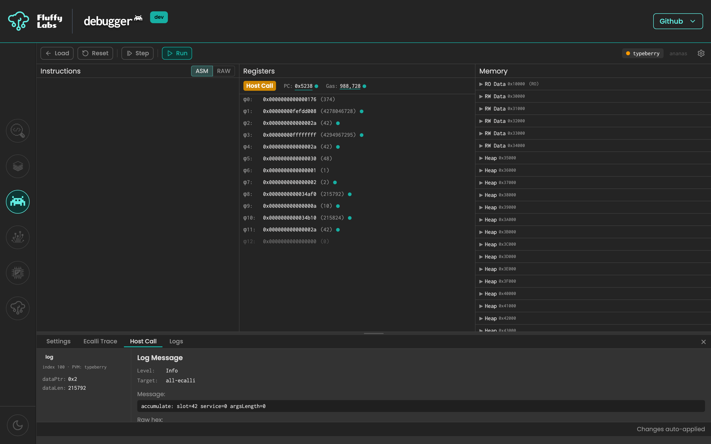

Storage host calls expose an editable key/value table so you can inspect or seed storage-backed effects before resuming.

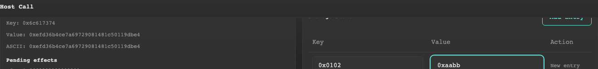

If your source includes a reference trace and the Host Call Policy allows it, matching host calls can auto-continue without opening the drawer.

## 9. Trace Comparison

Load a trace-backed example or trace file to compare the live execution trace against a reference trace. The Ecalli Trace drawer shows execution and reference columns side by side. When a value diverges, the differing row is highlighted.

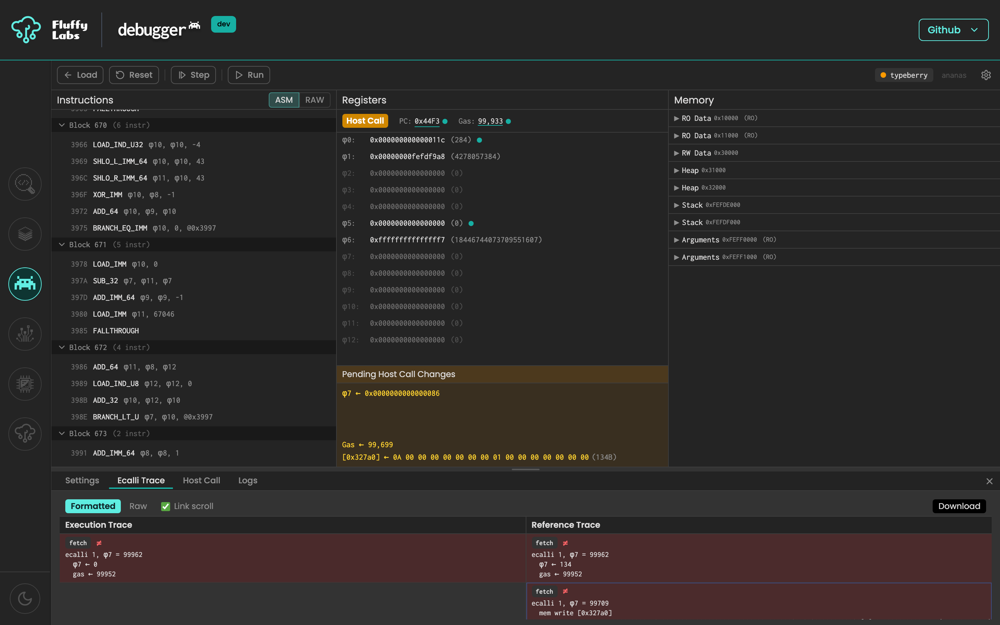

## 10. Settings

Open the Settings drawer to choose active PVMs, set the stepping mode, and decide when trace-backed host calls should auto-continue.

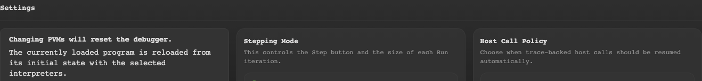

## 11. Multiple PVMs

Enable more than one PVM in Settings to compare implementations side by side. Use the PVM tabs in the top-right corner to switch the focused machine, and watch the divergence badge for disagreements in PC, gas, status, or registers.

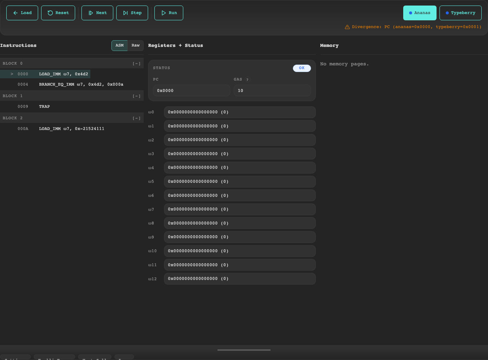

## 12. Persistence

The app remembers the currently loaded program across page refreshes and restores it at the initial loaded state. Settings persist independently, so stepping mode and active PVM choices survive reloads too. Use `Load` to return to the loader and clear the persisted program session.

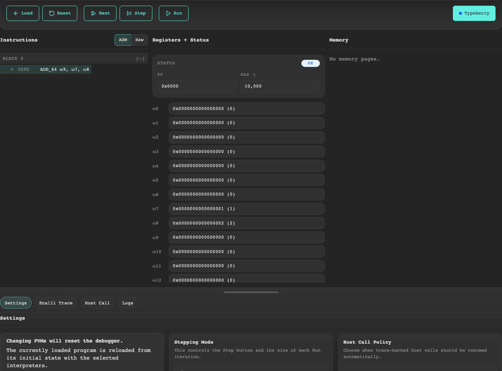
