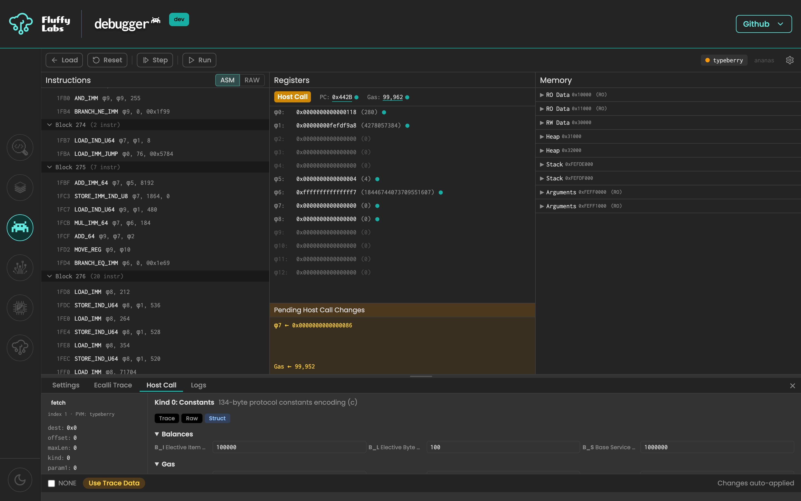
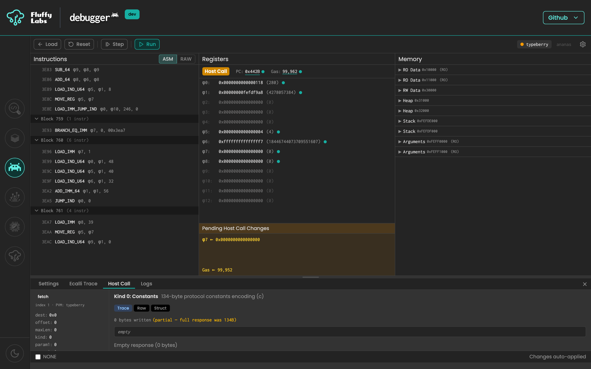

# PVM Debugger Usage Guide

PVM Debugger is a browser-based debugger for PolkaVM programs. You can load bundled examples, upload local files, inspect machine state, compare trace-backed host calls, edit pending host-call effects before resuming, and run multiple PVM implementations side by side.

## 1. Getting Started

Start the app locally with `npm run dev`, then open `http://localhost:5173`.


The left sidebar links to sibling Fluffy Labs tools. The bottom-left icon toggles dark/light mode. The debugger is the main content area.

## 2. Loading a Program

The loader offers four input sources. Non-SPI programs jump straight to the debugger; JAM SPI programs stop at a configuration step first.

### From Examples

The Examples column on the right groups bundled programs by category: Generic PVM, WAT → PVM, AssemblyScript, Large Programs, JSON Test Vectors, and Trace Files. Categories can be expanded or collapsed; Generic, AssemblyScript, and Trace Files are expanded by default. Click any example to load it.


### From File Upload

Drop a file or use the browse button to load `.jam`, `.pvm`, `.bin`, `.log`, `.trace`, or `.json` input from disk.


### From URL

Paste a direct file URL to fetch content into the loader. GitHub `blob` URLs are rewritten to raw content automatically before fetch.


### From Manual Hex Input

Paste raw hex bytes when you want to debug a tiny program without creating a file first. The loader validates the input when the field loses focus.


## 3. Configuring the Program

JAM SPI programs show a Program Summary with detection info and an SPI Entrypoint editor before loading into the debugger.


Choose `Refine`, `Accumulate`, or `Is Authorized` depending on which SPI entrypoint you want to invoke. Fill in the entrypoint-specific fields; the SPI Arguments hex is regenerated automatically from your inputs.

Toggle the RAW switch to edit the encoded argument bytes directly instead of using the builder form.


Press **Load Program** to send the program to the debugger. Gas is not set here; you can edit gas later while paused.

## 4. The Debugger Screen

Once the program loads, the debugger shows three columns: Instructions on the left, Registers and Status in the middle, and Memory on the right. Execution controls sit in the top toolbar, and the bottom drawer holds four tabs: Settings, Ecalli Trace, Host Call, and Logs. The active drawer tab is highlighted with a brand-colored underline.


If a render error ever escapes the app, an error boundary catches it and shows a "Reload" button that returns you to the loader.

## 5. Stepping Through Code

Use `Next` to advance according to the current stepping mode, `Step` to advance a single basic step, `Run` to continue until a stop condition, `Pause` to stop a run loop, and `Reset` to reload the program's initial state. Keyboard shortcuts:

- `F10` for `Next`
- `F5` for `Run` / `Pause`
- `Ctrl+Shift+R` for `Reset`

Choose `Instruction`, `Block`, or `N-Instructions` stepping from the Settings drawer. Breakpoints can be toggled by clicking the gutter of any instruction row in the Instructions panel.


## 6. Working With Registers and State

When execution is paused, you can edit the PC, gas, and all 13 registers inline. Click a register's hex value to open its editor. Registers show a fixed-width hex encoding with their decimal value in parentheses; the labels use the φ (phi) notation matching the Gray Paper spec. PC is displayed in hex; gas is displayed in decimal with a hex tooltip on hover. Changed values flash once and keep a small brand-colored dot until the next step.


When execution is paused at a host call, a **Pending Host Call Changes** banner appears inside the Registers panel. It previews the register writes, memory writes (coalesced into ranges with a short hex preview), and gas update that will be applied on resume. Use it to verify the effects before stepping forward.

## 7. Viewing Memory

Expand any mapped memory range to inspect bytes in a hex dump. Ranges are lazy-loaded, collapsed by default, and labeled with their role (RO Data, RW Data, Heap, Stack, Arguments) alongside the hex start address. Bytes that changed between the last two paused states are highlighted.


## 8. Host Calls

When execution pauses on an `ecalli`, the Host Call drawer opens automatically. Sprint 42 redesigned the drawer as a two-column layout: a sidebar on the left with host-call metadata, and a handler-specific editor on the right.


### Sidebar

- **Badge** with the host-call name (`fetch`, `log`, `write`, `read`, …) and its index.
- **Input registers** listed with labels defined per host call (e.g. `dest`, `maxLen`, `kind` for fetch).
- **Output preview** showing the value that will be written to `φ₇` on resume.
- **Memory write count** when the pending effects include memory writes.

### Editor (right column)

The right column adapts to the host call kind:

- **Fetch** (index 1) shows the fetch-handler editor with three modes — Trace, Raw, and Struct — plus a slice preview bar. See [Fetch Handler](#fetch-handler) below.
- **Storage read/write** (indices 3/4) shows the session-scoped key/value table so you can inspect or seed storage before resuming.
- **Log** (index 100) shows the decoded log level, target, and message content, with a raw hex fallback.

  

- **Other host calls** (gas, read, info, write, and anything not specifically handled) fall back to a generic text editor. Enter one command per line; blank lines and `#` comments are allowed. Parse errors are reported with the offending line number.

  ```
  # Return value in φ7
  setreg φ7 <- 0x2a

  # Write 4 bytes to memory
  memwrite 0x100 len=4 <- 0xdeadbeef

  # Set gas after the call
  setgas <- 500000
  ```

### Sticky bar

At the bottom of the drawer, a sticky bar shows:

- A **NONE** checkbox for host calls that accept it (fetch, lookup, read, info). Checking it returns `φ₇ = 2⁶⁴ − 1` and suppresses memory writes; the handler editor is hidden while NONE is active.
- **Use Trace Data** (amber pill) appears when you have edited the effects and a matching reference trace proposal exists. Clicking it resets the editor to the trace's proposed effects.
- **Changes auto-applied** — the drawer auto-applies edits on the fly, so there is no separate Apply button. Errors in the editor are surfaced here in red.

Use the normal `Next`, `Step`, or `Run` controls to resume past the host call. If your source includes a reference trace and the Host Call Policy allows it, matching host calls auto-continue without stopping.

### Fetch Handler

The fetch handler (sprint 43) supports all 16 fetch kinds (Protocol Constants, Entropy, Work Package, Operand, Transfer, Authorizer Info, …). Switch between three modes; the underlying bytes are preserved when you switch.



- **Trace** — read-only view of the reference trace's bytes, shown when the loaded source has a matching trace entry.
- **Raw** — a hex textarea for free-form editing of the full encoded response.
- **Struct** — per-kind structured form (for example, the Protocol Constants editor exposes the 134-byte constants schema with individual fields). The encoded output and a slice preview update as you edit.

A slice preview bar visualizes the `(offset, maxLen)` window the caller requested against the full encoded response.

## 9. Pending Changes

When paused at a host call, the Pending Host Call Changes banner in the Registers panel summarizes everything that will apply on resume: register writes (`φ<N> ← value`), gas (`Gas ← value`), and memory writes as coalesced address ranges with a short hex preview and total byte count (e.g. `[0x327a0] ← 0a 00 00 … (134B)`).



Edits you make in the Host Call drawer — manual register overrides, memory edits, storage overrides, fetch mode changes — feed back into this banner so you can double-check before stepping.

## 10. Trace Comparison

Load a trace-backed example or trace file to compare the live execution against a reference trace. The Ecalli Trace drawer shows the Execution Trace and Reference Trace columns side by side; when a value diverges, the differing row is highlighted.


Above the columns:

- **Formatted** / **Raw** — switch between a decoded view and the raw trace bytes.
- **Link scroll** — when enabled, scrolling one column scrolls the other in lock-step.
- **Download** — save the current execution trace as a `.log` file.

## 11. Settings

Open the Settings drawer to choose active PVMs, set the stepping mode, and decide how trace-backed host calls should behave during Run.


- **PVM Selection** — pick one or more PVMs. Changing selection resets the debugger state.
- **Stepping Mode** — `Instruction`, `Block`, or `N-Instructions` (with an adjustable count).
- **Host Call Policy** — `Always` (auto-continue past every host call using trace data), `When Trace Matches` (default; auto-continue only when the live host call matches the reference), or `Never (Manual)` (always pause for manual review).

## 12. Multiple PVMs

Enable more than one PVM in Settings to compare implementations side by side. The two available interpreters today are **typeberry** (reference, from `@typeberry/lib`) and **ananas**. The PVM tabs in the top-right corner switch which machine is focused in the main panels, and a divergence badge appears when they disagree on PC, gas, status, or registers.


## 13. Persistence

The app remembers the currently loaded program across page refreshes and restores it at its initial loaded state. Settings persist independently, so stepping mode, PVM selection, and host-call policy survive reloads. Use `Load` to return to the loader and clear the persisted program session.


## Regenerating Screenshots

The screenshots in this guide are produced by Playwright scripts in `apps/web/screenshots/`. To refresh them after UI changes, rebuild the app and rerun the capture scripts:

```bash
npm run build
cd apps/web && npm run screenshots
```

Each screenshot is one test that drives the app into the right state before calling `page.screenshot()`. Add new captures by extending an existing file in `apps/web/screenshots/` or creating a new `*.screenshot.ts` file; see the directory's README for conventions.
